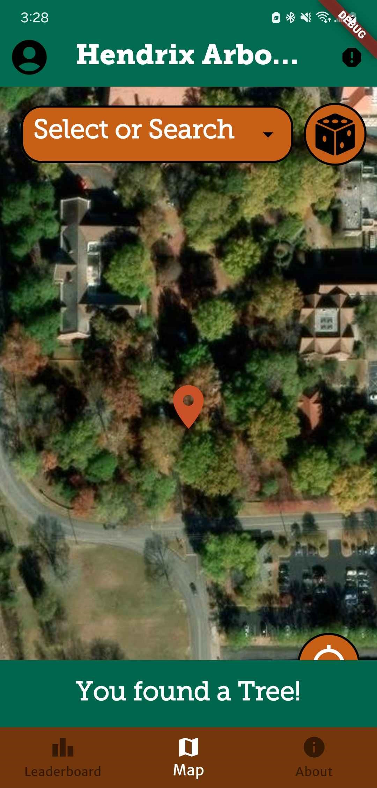
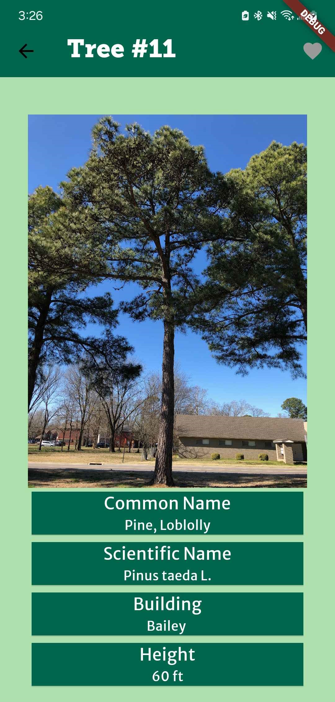
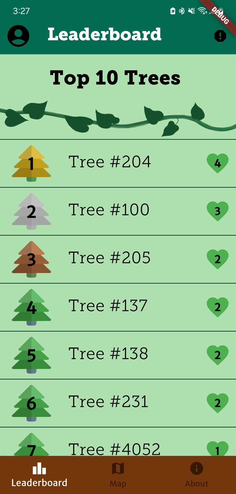
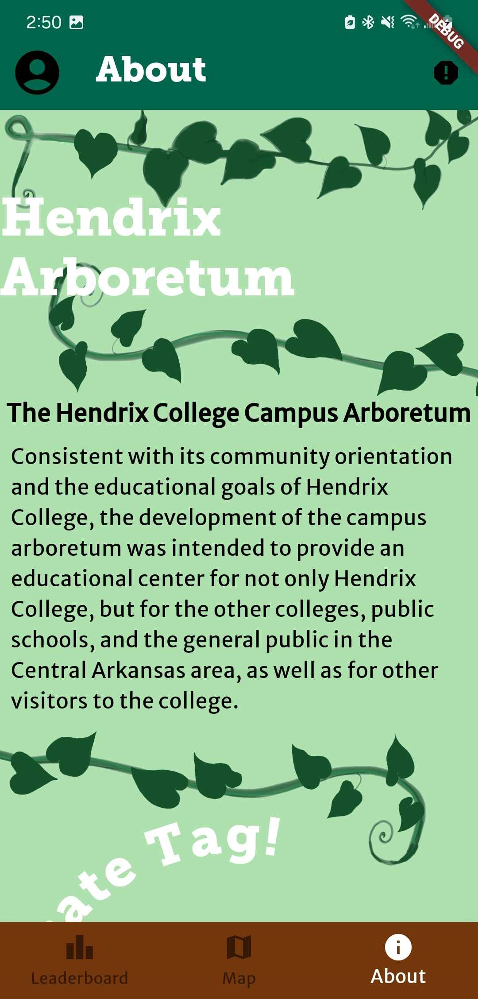
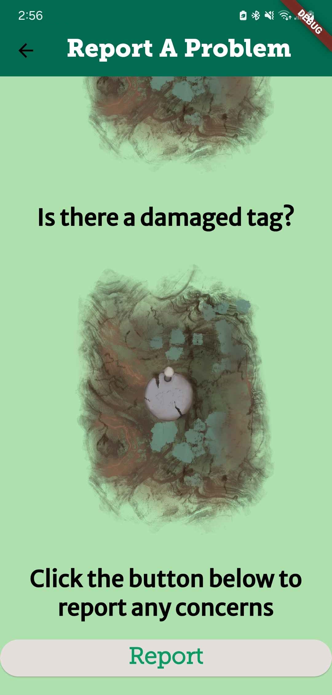

# Hendrix-Arboretum

This app is for members of the Hendrix, Conway, and tree enthusiast communities to be able to discover and engage with the trees and other users.

Users can search for specific trees on campus using the ID, common name, or scientific name. They can also use the nearby trees button to find the five closest trees to their location. Users can log in to like trees as well as make comments about trees. The top most liked trees are displayed on the leaderboard page.

